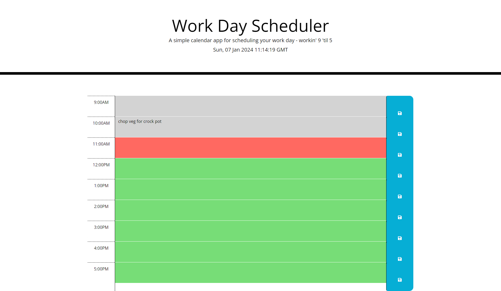

# Calendar-App-for-2024

A basic calendar app that enables you to save events for each hour of the day. Never forget an appointment again!

It is colour-coded according to time; past slots are shown in grey, the current slot is in red and future slots are shown in green.

I used Day.js to make the time dyanmic and take in the current date and time, and created a variable theTimeRightNow to identify the most recently passed hour (ie. if it's 11:19AM right now, it would parse '11'), and time-coded IDs in the HTML for each time slot so that I could compare the time with the slots to identify how to colour-code the slots.

I didn't need to touch the stylesheet - the CSS was all provided.



## User Story

```md
AS AN employee with a busy schedule
I WANT to add important events to a daily planner
SO THAT I can manage my time effectively
```
